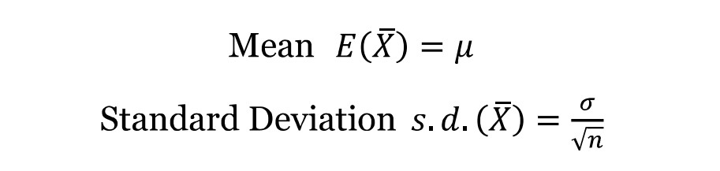
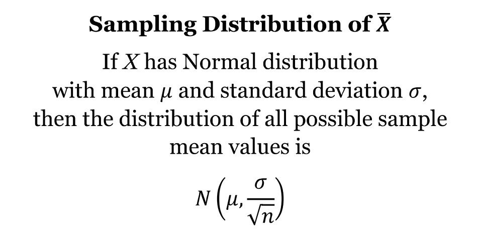
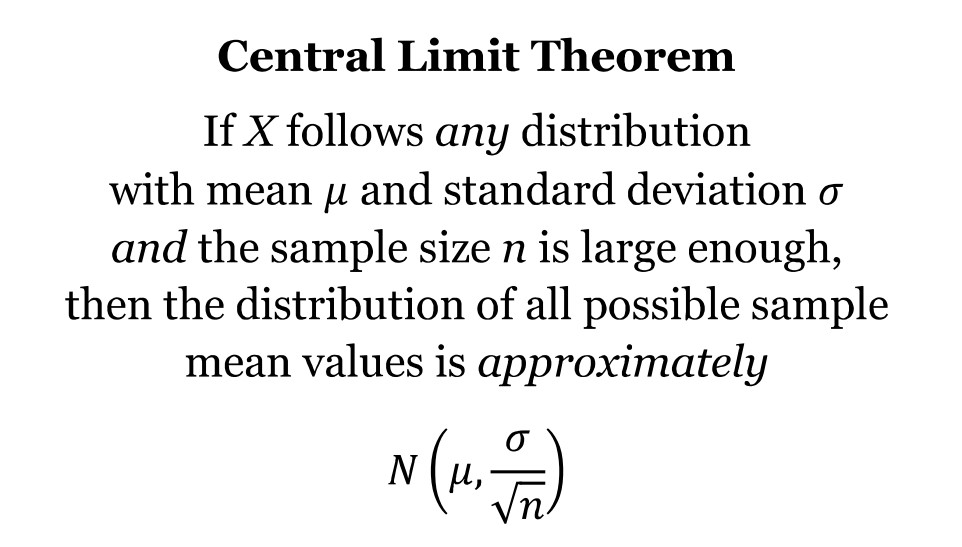
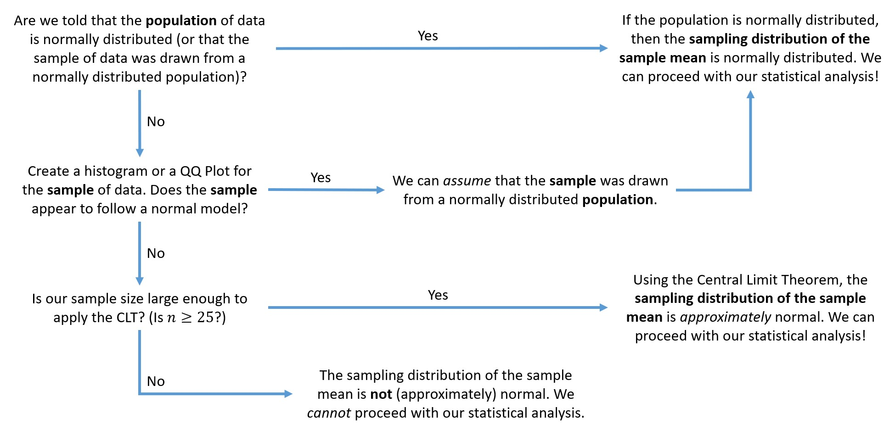
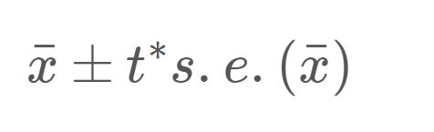
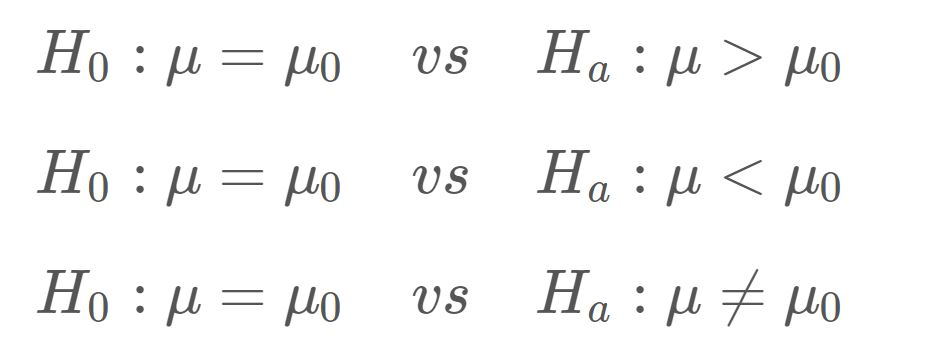
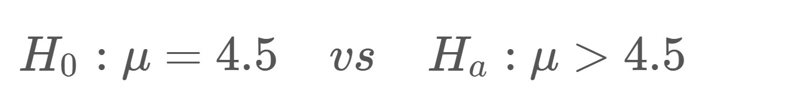

```{r setup, include = FALSE}
knitr::opts_chunk$set(echo = TRUE)
```

### Learning Objectives
1. Review of the sampling distribution of the sample mean
2. Check for normality using QQ plots
3. Understand when to apply the Central Limit Theorem (CLT)
4. Estimate one population mean with a confidence interval
5. Carry out a hypothesis test for one population mean

### Functions
1. `qqnorm()`
2. `qqline()`
3. `t.test()`
4. `qt()`
5. `pt()`


***


## Statistical Review

### Sampling Distribution of Xbar

As we have seen many times this semester, the value of a statistic varies from sample to sample. Because the values of a statistic vary from sample to sample, we can create a sampling distribution for it. This allows us to see how all possible values of that statistic would fall for repeated samples of the same size. 

This week, our statistic is a sample mean (or Xbar) and our sampling distribution is the sampling distribution of the sample mean. Knowing the center, spread, and shape of this *theoretical* distribution helps us create confidence intervals and run hypothesis tests for a mean! We have formulas and rules that help us define these aspects (which we simulated in Lab 3). 

{width=400px}

We can use the above properties for **any** sample size! What can we say about the shape of this sampling distribution? Is it normal? Is it approximately normal? How can we tell? 

Think About It: True or False? - In order for the sampling distribution of the sample mean to be normal (or approximately normal), the sample size must be at least 25.


For the sampling distribution of the sample mean, we have the following property (listed on the formula sheet located on our Student Resources page):

{width=450px}

If our population of data is normal, then the sampling distribution of the sample mean is also normal - *no matter what our sample size is*. We saw this in Lab 3!


### Checking for Normality 

If we don't have the entire population of data, how can we determine if the population of data is normal? We can use our *sample* of data and make *assumptions* about the population!

- If the sample appears to follow a normal model, then it is reasonable for us to assume that this sample was drawn from a normally distributed population

- If the sample does not appear to follow a normal model, then it is not reasonable for us to assume that this sample was drawn from a normally distributed population 

So how can we tell if our sample appears to follow a normal model? We can create a histogram for the variable of interest. But first, we need some data!


***


## Coding Examples

### NHANES Data

In this lab, we will be using data from NHANES - the National Health and Nutrition Examination Survey. This is a program of studies designed to assess the health and nutritional status of adults and children in the United States. You can find more information about NHANES [here](https://www.cdc.gov/nchs/nhanes/about_nhanes.htm). 

NHANES is a very extensive data set, but we have filtered it down to a random sample of 82 participants and a set of ten variables, described below. 

- `height`: height (in cm)
- `weight`: weight (in kg)
- `BMI`: body mass index (in kg/m^2)
- `arm`: arm circumference (in cm)
- `chol`: cholesterol level (in mg)
- `iron`: iron level (in mg)
- `hgb`: hemoglobin (in g/dL)
- `caffeine`: caffeine amounts (in mg)
- `rbcc`: red blood cell count (in millions of cells/uL)
- `wbcc`: white blood cell count (in millions of cells/uL)

Let's read in the data using the code chunk below.

```{r readnhanes}
nhanes <- read.csv("nhanes_sample.csv")
```

And here's a quick preview of the data.

```{r previewnhanes}
head(nhanes)
```

Now that we have our data, let's create a histogram for the variable `height`. Remember, we should always include a good title and x-axis label for this plot.

```{r histReview}
hist(nhanes$height, 
     main = "Histogram of Heights \n for a Sample of 82 Participants",
     xlab = "Height (in cm)")
```

Does the sample of heights appear to follow a normal model? Yes! 

The histogram appears to be unimodal, approximately symmetric, and approximately bell-shaped. So what does this mean?

**IMPORTANT**

1. Conclusion about the **sample**: Our sample of heights appears to follow a normal model because the histogram is approximately bell-shaped

2. Conclusion about the **population** (that the sample was drawn from): Because the sample appears to follow a normal model, we can *assume* that this sample was drawn from a normally distributed population of heights

3. Conclusion about the **sampling distribution of the sample mean**: Because we can assume the population of heights is normally distributed, we can assume that the sampling distribution of the sample mean (the distribution of all possible sample mean heights from samples of size 82) is normal 

4. What do these conclusions imply about the **inference procedure**? Because we can assume that the sampling distribution of the sample mean is normal, we can proceed with creating a confidence interval or running a hypothesis test for the population mean height


That's a lot to digest, but it's very important to understand these ideas. Now is a great time to ask questions!


### QQ Plots

Another popular plot used to check for normality is a **QQ plot** (or quantile-quantile plot). This graph plots our data against a theoretical normal distribution. In order to conclude that our sample of data appears to follow a normal model, *we want to see our observations approximately follow around and along the line* (sometimes called the identity line) produced by the plot. Let's see what we're talking about.

To create a QQ plot, we need to utilize two functions, back-to-back. The first (`qqnorm()`) will create the plot of our observations, and the second (`qqline()`) will add the line to it. As always, we should add a title to the plot (but there is no need to change either of the axis labels).

```{r qqheights}
qqnorm(nhanes$height, main = "QQ Plot of Heights")
qqline(nhanes$height)
```

This is a fantastic QQ plot! The observations follow roughly along and around the line. There are no *major* deviations or *obvious* patterns. 

Do the points line up *perfectly* on the line? No, and that's okay! We should not expect the data to line up perfectly. Instead, we want to make sure there aren't any major deviations or obvious patterns straying from the line. These are *random* samples, so we should always expect to see some deviations or imperfections. 

So what are our conclusions from the QQ plot above?

1. Conclusion about the **sample**: Our sample of heights appears to follow a normal model because the points approximately follow around and along the line

2. Conclusion about the **population** (that the sample was drawn from): Because the sample appears to follow a normal model, we can *assume* that this sample was drawn from a normally distributed population of heights

3. Conclusion about the **sampling distribution of the sample mean**: Because we can assume the population of heights is normally distributed, we can assume that the sampling distribution of the sample mean (the distribution of all possible sample mean heights from samples of size 82) is normal 

4. What do these conclusions imply about the **inference procedure**? Because we can assume that the sampling distribution of the sample mean is normal, we can proceed with creating a confidence interval or running a hypothesis test for the population mean height


Okay, let's observe a "bad" QQ plot. Let's plot the cholesterol levels (`chol`) for the sample of 82 participants. 

```{r qqchol}
qqnorm(nhanes$chol, main = "QQ Plot of Cholesterol Levels")
qqline(nhanes$chol)
```

In both the lower and upper tails of the plot, the observations pull away from the line in a *severe* manner. 

1. Conclusion about the **sample**: Our sample of cholesterol levels does *not* appear to follow a normal model because the points pull away from the line in a severe manner

2. Conclusion about the **population** (that the sample was drawn from): Because the sample does not appear to follow a normal model, we *cannot assume* that this sample was drawn from a normally distributed population of cholesterol levels

3. What does this mean for the sampling distribution of the sample mean? We will discuss this in the next section. For now, let's get more practice with QQ plots. 


Let's see what the histogram would have looked like for the cholesterol levels.

```{r histCholesterol}
hist(nhanes$chol, 
     main = "Histogram of Cholesterol Levels \n for a Sample of 82 Participants",
     xlab = "Cholesterol Levels (in mg)")
```

Note: you will not need to know which QQ plot patterns correspond to a left or right skewed histogram. Just know that we want the points to roughly follow along and around the line.


Okay, your turn!

**Demo #1:** Create a QQ plot of red blood cell counts (`rbcc`) for the sample of 82 participants. 

```{r demo1, error = T}
# Replace this text with your code

``` 

Think About It: Does the sample of red blood cell counts appear to follow a normal model? Could you *assume* that the sample was drawn from a normally distributed population of red blood cell counts? 


Earlier, we said that we do not expect the points to line up *perfectly* on the line. Random samples will not always produce *perfectly* normal distributions - even if the sample was drawn from a normally distributed population. 

In the code chunk below, we use the `rnorm()` function to draw a random sample of 50 from a normally distributed population. Run the code chunk several times to see what QQ plots can look like for random samples of 50 drawn from a normally distributed population!

```{r NormalPopulationExample}
randomsample <- rnorm(50)
qqnorm(randomsample)
qqline(randomsample)
```

**Important Disclaimer**: Sometimes these plots will be difficult to interpret - they can be subjective and there can be quite a bit of gray area. Always be sure to justify your answer by describing what you see.


**Think-Pair-Share #1:** Consider the following questions:

```{r thinkpairshare1, error = T}
qqnorm(nhanes$caffeine, main = "QQ Plot of Caffeine Amounts")
qqline(nhanes$caffeine)
``` 

- Which of the following is *observed* in the QQ plot above: the population of caffeine amounts for all NHANES participants, a sample of 82 caffeine amounts for 82 NHANES participants, or the distribution of all possible sample mean caffeine amounts?

- Which of the following can we make *assumptions* for (based on the QQ plot above): the population of caffeine amounts for all NHANES participants, a sample of 82 caffeine amounts for 82 NHANES participants, or the distribution of all possible sample mean caffeine amounts?

- What conclusions can be made from the plot?


### Central Limit Theorem

What if it isn't reasonable to assume our sample of data was drawn from a normally distributed population? (As we saw with the cholesterol levels and caffeine amounts above.)

We might be able to rely on the Central Limit Theorem to help us! The CLT states:

{width=400px}  

So what is large enough? We use the general rule of thumb that the sample size must be at least 25.

If our sample size is at least 25, then the *sampling distribution of the sample mean* will be approximately normal and we can proceed with our statistical analysis.

With the non-normal examples above, we would have the following logic flow:

1. Conclusion about the **sample**: Our sample of cholesterol levels (or caffeine amounts) does *not* appear to follow a normal model because the points pull away from the line in a severe manner

2. Conclusion about the **population** (that the sample was drawn from): Because the sample does not appear to follow a normal model, we *cannot assume* that this sample was drawn from a normally distributed population of cholesterol levels (or caffeine amounts)

3. Conclusion about the **sampling distribution of the sample mean**: Because our sample size is large enough (82 > 25), we can apply the Central Limit Theorem which states that the sampling distribution of the sample mean (the distribution of all possible sample mean values from samples of size 82) will be approximately normal 

4. What do these conclusions imply about the **inference procedure**? Because we can assume that the sampling distribution of the sample mean is approximately normal, we can proceed with creating a confidence interval or running a hypothesis test for the population mean cholesterol level (or population mean caffeine amount)


Think of the Central Limit Theorem as a *back-up plan*. When we cannot assume that our sample of data was drawn from a normally distributed population, we can rely on the CLT to help us out! 


### Normality Road Map

This can certainly get confusing so we created a road map for checking the normality assumption.




### The t-Distribution

If we have determined that the sampling distribution of Xbar is either normal or approximately normal, we can proceed with our statistical analysis using the t-distribution.

The t-distribution is a symmetric, unimodal distribution that is centered at 0. It is very similar to the standard normal distribution, but has heavier (or wider) tails depending on the degrees of freedom. These wider tails will give us more conservative tail probabilities. 

This distribution is used when the true standard deviation (sigma) is unknown. Instead, we use the sample standard deviation (s) as an estimate of the population standard deviation to compute the *standard error* of xbar. Because we are using an estimate of the spread, we will utilize this slightly wider (more conservative) distribution for any statistical inference procedures.  


### Confidence Intervals

A confidence interval provides us with a range of reasonable values for an unknown parameter. Our new parameter of interest is now the population mean, mu. When we don't know the value of this parameter, we can *estimate* it using the sample mean, xbar. With this estimate, we add some margin of error (or "wiggle room" so to speak) to create a confidence interval. 

The equation for our confidence interval is:

{width=180px}

We can use the `t.test()` function to create this interval. Let's use the NHANES data set to create a 90% confidence interval that estimates the population mean height of NHANES participants. To do this, we need to specify two arguments: 

- the variable of interest (`dataset$variable`)
- the confidence level (`conf.level`)

Let's see an example:

```{r CIoneMean}
t.test(nhanes$height, conf.level = 0.90)
```

Right away, the output seems strange because we get a test statistic and a p-value. **Ignore this.** We are only concerned with the second half of the output. 

The 90% confidence interval is (165.5342 cm, 169.2487 cm). We estimate, with 90% confidence, that the population mean height of NHANES participants is between 165.53 and 169.25 centimeters.

**Demo #2:** Create the 99% confidence interval for the population mean cholesterol level for the NHANES participants.

```{r demo2, error = T}
# Replace this text with your code

```

Think About It: True or False? To create this confidence interval, a t* multiplier of 9.6766 was used (as shown in the output). 


### Multipliers

If we wish to calculate the t* multiplier, we can use the `qt()` function. This function takes three arguments:

- `p`: this value should be half of the "leftover" area (more info below)
- `df`: the degrees of freedom
- `lower.tail`: we will always set this argument to FALSE

So what do we mean by half of the "leftover" area? If we want to create a 90% confidence interval, then our "leftover" area is 10% and half of this is 5% - or 0.05.

```{r multiplierExample1}
qt(p = 0.05, df = 81, lower.tail = FALSE)
```

This multiplier was used in creating the 90% confidence interval for mean height. 

If we want to create a 99% confidence interval, then our "leftover" area is 1% and half of this is 0.5% - or 0.005.

```{r multiplierExample2}
qt(p = 0.005, df = 81, lower.tail = FALSE)
```

This multiplier was used in creating the 99% confidence interval for mean cholesterol level (in Demo 3). 

**Demo #3:** Find the t* multiplier used to create the *95%* confidence interval for the population mean cholesterol level for the NHANES participants. 

```{r demo3, error = T}
# Replace this text with your code

```


### Hypothesis Testing

A hypothesis test helps us judge whether or not a statement about a population is reasonable or not. The procedure for running any hypothesis test involves four steps:

1. Determine appropriate null and alternative hypotheses 
2. Check the assumptions for performing the test  
3. Calculate the observed sample proportion and the test statistic. Then, determine the p-value.
4. First, evaluate the p-value and determine the amount of evidence against the null hypothesis. Then, make a conclusion in the context of the problem.

Our parameter of interest is now the population mean, mu. When setting up the hypotheses, we have three options.

{width=340px}

Suppose it is currently believed that individuals have 4.5 million red blood cells per microliter (uL), on average. A medical researcher, however, believes that the true mean red blood cell count is actually *greater* than this value. We could use our NHANES data to test the following hypotheses:

{width=340px}

To run this hypothesis test, we use the `t.test()` function and have three arguments to specify:

- variable of interest (`dataset$variable`)
- `mu`: hypothesized value of mu
- `alternative`: alternative hypothesis ("less", "greater", or "two.sided")

Our code would look like this:

```{r HToneMean}
t.test(nhanes$rbcc,
       mu = 4.5,
       alternative = "greater")
```

The output seems strange because we get output for a confidence interval. **Ignore this.** We are only concerned with the first half of the output. The first half of this output tells us:

- the observed t-test statistic (3.1778)
- the degrees of freedom for the t-distribution (81)
- the corresponding p-value (0.001051)

**Evaluation:** With a p-value of 0.001051, there is very strong evidence against the null hypothesis and in support of the alternative hypothesis.

**Conclusion:** Based on the data, we have very strong evidence to suggest that the population mean red blood cell count is greater than 4.5 million cells per microliter for NHANES participants.


**Demo #4:** Suppose an old report claimed that the population mean caffeine amount was 150 milligrams and we wish to determine if this value has *changed*.

```{r demo5, error = T}
# Replace this text with your code

```

Think About It: If we had hypothesized that the population mean caffeine amount had decreased (compared to the claimed value in the old report), would we get a small or large p-value? Why?


**Think-Pair-Share #2:** Consider the following statements and questions:

**Evaluation:** With a p-value of 0.1747, there is not enough evidence against the null hypothesis and in support of the alternative hypothesis.

**Conclusion:** Based on the data, we can conclude that the population mean caffeine amount is 150 milligrams for NHANES participants.

- Why is this conclusion in appropriate?
- What should our conclusion be instead?


If you are interested in learning how to calculate p-values using R, you can check out the additional section below at a later time! For now, click on the file titled `lab05assignment.Rmd` in the bottom right window to open up the lab assignment. Please do not hesitate to ask questions! 


### Optional!

#### Calculating p-values

To calculate p-values, we can use the Shiny App (linked on Canvas) or we can use the `pt()` function in R!

The function takes the following arguments:

- `q`: the observed value of the t-test statistic
- `df`: the degrees of freedom
- `lower.tail`: the direction - if set to TRUE, the function will calculate the probability of observing a value less than q; if set to FALSE, the function will calculate the probability of observing a value greater than q

Suppose we wanted to use R to calculate the p-value for the `HToneMean` example above. The observed t-test statistic was t = 3.1778, the degrees of freedom were df = 81 and the alternative hypothesis was Ha: mu > 4.5. To calculate this p-value, we would use the following code:

```{r ptExample1}
pt(q = 3.1778, df = 81, lower.tail = FALSE)
```

In Demo #4, we found a test statistic of t = 1.3694, but the alternative hypothesis was *two-sided* (we wanted to determine if the stated mean caffeine level has *changed*). To calculate this p-value, we would use the following code:

```{r pnormExample2}
2 * pt(q = 1.3694, df = 81, lower.tail = FALSE)
```

In the above example, we have to multiply the result by 2 because we are running a two-tailed hypothesis test. The `pt()` function gives us the area of the upper tail, but we want to report the area for both tails - so we double it!

